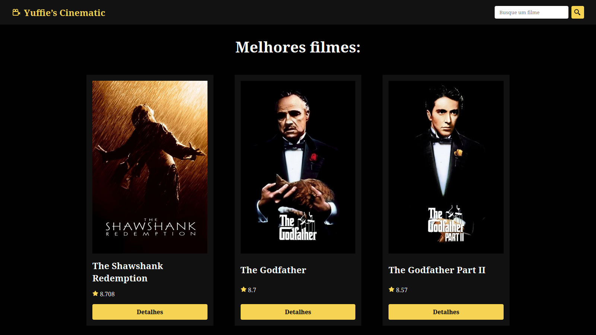
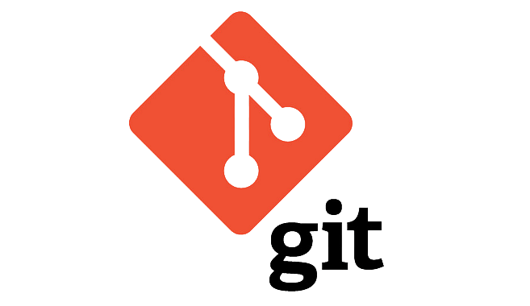
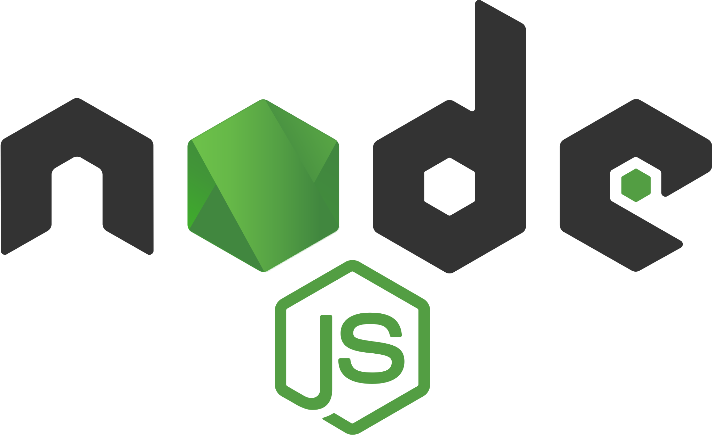

# Yuffie’s Cinematic

<ul>
  <li><h3><i>Página principal do projeto:</i></h3></li>
</ul>



## 🚀 Começando

<div align=center>

<span style="font-size: 1.8em">Pré-requisitos</span>

  
  
</div>

## Instalação

Para executar localmente, siga os seguintes passos:

1.  **Clone o repositório:**

    ```bash
    git clone https://github.com/0nF1REy/yuffie-cinematic.git
    ```

2.  **Entre no diretório:**

    ```bash
    cd yuffie-cinematic
    ```

3.  **Instale as dependências:**

    ```bash
    npm install
    ```

4.  **Crie um arquivo `.env` na raiz do projeto:**

    *   Adicione as variáveis de ambiente necessária:

    ```yaml
    VITE_API_KEY=api_key=<SEU_VALOR_AQUI>
    VITE_API=https://api.themoviedb.org/3/movie/
    VITE_SEARCH=https://api.themoviedb.org/3/search/movie
    VITE_IMG=https://image.tmdb.org/t/p/w500/
    ```

## Rodando

Para iniciar, use o comando:

```bash
npm run dev
```
Resposta:
```bash
 ✓ VITE v6.0.7 ready in 300ms
```

## Autor 🧑🛡️ 

<div align="center">
  <table>
  <tr>
    <td align="center">
      <a href="https://github.com/0nF1REy" target="_blank">
        <br>
          <b>Alan Ryan</b>  
      </a>
    </td>
  </tr>
</table>
</div>

## 📫 Contribuir

Se você deseja contribuir com o projeto, siga os seguintes passos:

1. **Faça um fork** do repositório.

2. **Crie uma branch** com a sua funcionalidade:

   ```bash
   git checkout -b feature/minha-funcionalidade
   ```

3. **Faça as alterações necessárias**.

4. **Faça um commit** com suas alterações:

   ```bash
   git commit -m "Adicionado minha funcionalidade"
   ```

5. **Envie para o repositório remoto**:

   ```bash
   git push origin feature/minha-funcionalidade
   ```

6. **Abra um pull request** para a branch `main` do projeto original.

### Documentações úteis

- **<a href="https://www.atlassian.com/br/git/tutorials/making-a-pull-request" target="_blank">📝 Como criar uma solicitação pull</a>**

- **<a href="https://gist.github.com/joshbuchea/6f47e86d2510bce28f8e7f42ae84c716" target="_blank">💾 Padrão de commit</a>**

## Licença

<a href="./LICENSE" target="_blank"><b>Licença MIT</b></a>